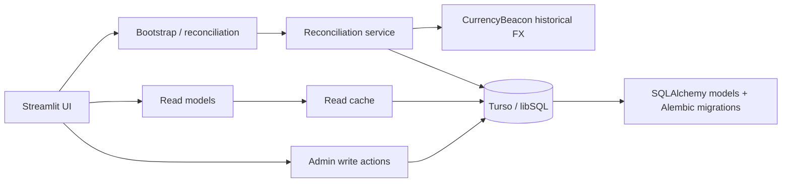

# Spotify Family Ledger

[](https://github.com/abocha/spotify-family-ledger/actions/workflows/ci.yml)

A small, self-healing accrual ledger for a shared Spotify Family subscription where the owner pays in USD and members reimburse in RUB.

**Live app:** https://spotify-family-ledger.streamlit.app/

The core problem is not subscription management. It is preserving a fair, explainable history when exchange rates move, payments arrive irregularly, and the app may sleep for weeks between visits.

## Core invariants

- **Posted months are the truth.**
- **Historical FX is locked per billing month.**
- **Wake-up reconciliation is idempotent.**
- **Balances are derived, never hand-maintained.**
- **If reconciliation cannot complete exactly, the app reports a degraded state instead of inventing certainty.**

These constraints turn a tiny household utility into a useful accounting and reliability problem: historical data must remain stable, missed billing cycles must be reconstructed deterministically, and every displayed balance must be explainable from ledger events.

## How it works

On startup, the app reconciles the ledger from the last known good billing cycle to the present:

1. Find the latest posted cycle.
2. Determine which billing months are missing.
3. Fetch the historical USD/RUB rate for each missing month.
4. Create the posted cycle and locked member charges.
5. Commit each month only when it is internally consistent.
6. Stop at the first unreconcilable month and surface that state explicitly.

Members can inspect balances, historical charges, FX rates, and payments. Admin-only actions cover payment entry, member management, adjustments, and manual reconciliation retries.

## Architecture



The deployed app intentionally targets low-cost infrastructure:

- **UI/runtime:** Streamlit Community Cloud
- **database:** Turso / libSQL
- **ORM/migrations:** SQLAlchemy + Alembic
- **validation/config:** Pydantic
- **historical FX:** CurrencyBeacon

Because Streamlit Community Cloud may sleep between visits, correctness after wake-up matters more than always-on background processing.

## Reliability behavior

The read path is integrity-gated before balances or statements are shown. A stale but previously valid ledger can remain readable, while ordinary financial writes are disabled until reconciliation becomes healthy again.

Read-heavy screens use caching to reduce remote database latency. Reconciliation runs once per session and preserves locked historical FX rather than recalculating old months from current rates.

The current product has three main views:

- **Home:** ledger health, balances, and recent payments
- **Statements:** per-member charge/payment history
- **Admin:** member management, payment entry, adjustments, and reconciliation controls

For the detailed system design, see [docs/v2_blueprint.md](docs/v2_blueprint.md). Additional notes live in [docs/design.md](docs/design.md) and [docs/fx_strategy.md](docs/fx_strategy.md).

## Local development

Requires Python 3.13+ and [uv](https://docs.astral.sh/uv/).

Install the locked environment:

```bash
uv sync --frozen
```

Create a local `.env`:

```env
TURSO_URL=sqlite:///local.db
TURSO_KEY=
SUBSCRIPTION_USD=8.00
CUTOVER_DATE=2026-04-20
CURRENCYBEACON_API_KEY=your_key_here
```

`ADMIN_PASSWORD_HASH` is optional for public local browsing and required for admin mode.

Initialize the database:

```bash
uv run alembic upgrade head
```

Optionally seed a fresh local database:

```bash
uv run python scripts/seed_from_scratch.py
```

Run the app:

```bash
uv run streamlit run app.py
```

## Validation

```bash
uv run pytest tests/
uv run ruff check .
uv run ty check .
```

CI runs the same test and static-analysis checks on pushes and pull requests.

## Deployment

For Streamlit Community Cloud, use `app.py` as the entry point and configure the runtime secrets in the app settings:

```toml
TURSO_URL = "your_turso_url"
TURSO_KEY = "your_turso_key"
SUBSCRIPTION_USD = "8.00"
CUTOVER_DATE = "2026-04-20"
CURRENCYBEACON_API_KEY = "your_key_here"
ADMIN_PASSWORD_HASH = "your_bcrypt_hash_here"
```

Optional Telegram notification credentials are supported through `TELEGRAM_BOT_TOKEN` and `TELEGRAM_CHAT_ID`.

Apply database migrations before first use:

```bash
uv run alembic upgrade head
```
